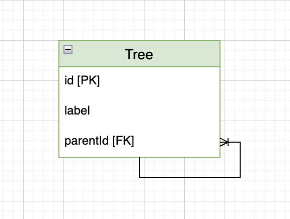

# Database

## Tree schema

### Using Typeorm

```
@Entity()
export default class Tree {
  @PrimaryGeneratedColumn()
  id: number;

  @Column()
  label: string;
 
  @ManyToOne(() => Tree, treeParent => treeParent.children, {
        onDelete: 'CASCADE',
        nullable: true,
    })
  parent: Tree;

  @OneToMany(() => Manufacturer, treeChildren => manufacturerChild.parent ,
    {
      cascade: true,
    },
  )
  children: Tree[];
}
```
or
```
@Entity()
@TreeEntity('materialized-path')
export default class Tree {
  @PrimaryGeneratedColumn()
  id: number;

  @Column()
  label: string;

  @TreeChildren()
  children?: Tree[];

  @TreeParent()
  parent?: Tree;
}
```
- https://orkhan.gitbook.io/typeorm/docs/tree-entities
### Standard Schema
```

Entity Tree {

  @PK()
  id: number;

  label: string;

  @FK()
  parentId: string | null;
}
```

### Using Diagrams.net

## Queries

### GET Tree
#### Typeorm
```
 public async get(): Promise<Tree[]> {
    const tree = this.ormRepository
      .createQueryBuilder('tree')
      .addOrderBy('tree', 'ASC');
      .getMany();

    return tree;
  }
```
ps: Typeorm does have support to get the tree list as a tree structure. 
https://orkhan.gitbook.io/typeorm/docs/tree-entities
#### SQL
```
SELECT label, "parentId" FROM tree order by id ASC;
```
- Using the actual logic, if we sort by id, it will be the same thing to sort by creating order,
  because the newest tree will have a higher id than the oldest one, and the parents of the children will always come first.
- The parents going first is a necessary step to creating the tree correctly.
- If we need to add a random id like UUID, I recommend adding a new column at Tree entity names: createdAt. This column will
  be a Date type and will save the timestamp when the new tree is added in our DB, so we will be able to sort the father before the children.
### POST Tree
#### Typeorm
```
  public async save(tree: CreateTreeDto): Promise<Tree> {
    return this.ormRepository.save(tree);
  }
```
#### SQL
```
INSERT INTO tree (label, "parentId") VALUES (:label, :parentId);
```

